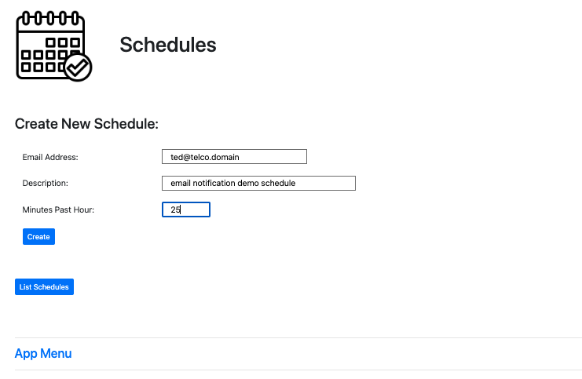
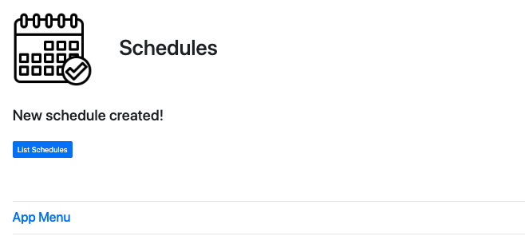
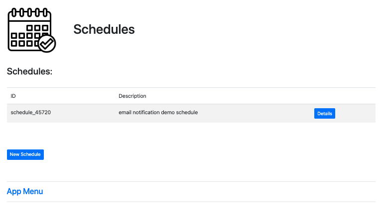
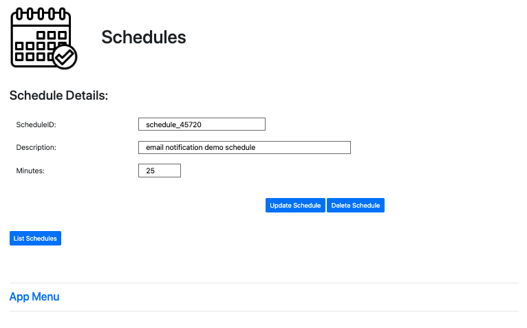
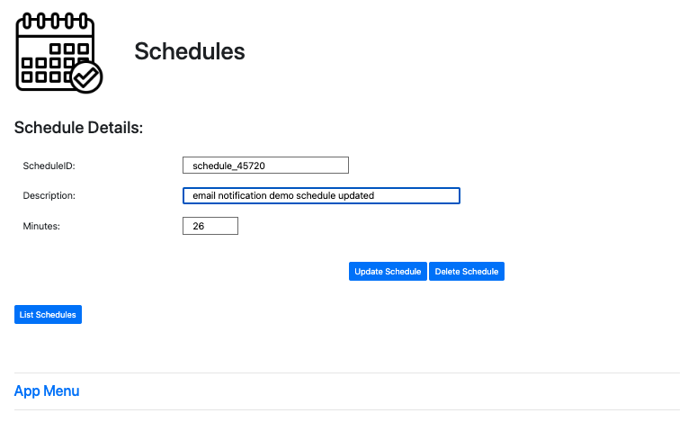
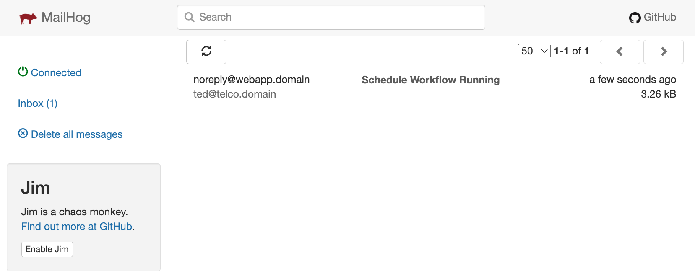
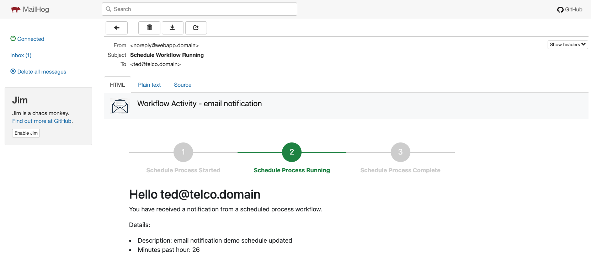
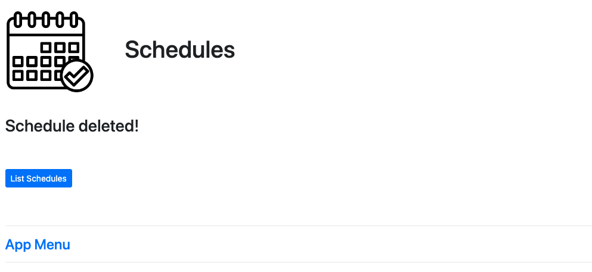
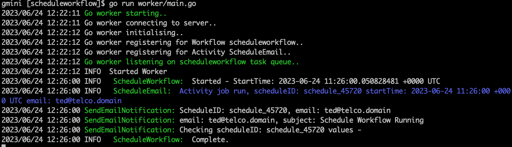

# Temporal Schedule
Quick demo of using temporal schedule feature.  
Schedules are created with most of the values hardcoded for demoing, the comment and minutes past the hour can be set and updated.  
The workflow activity sends a formatted email to local MailHog docker image UI.

  

  

  

  

  

  

  

  

  

  
