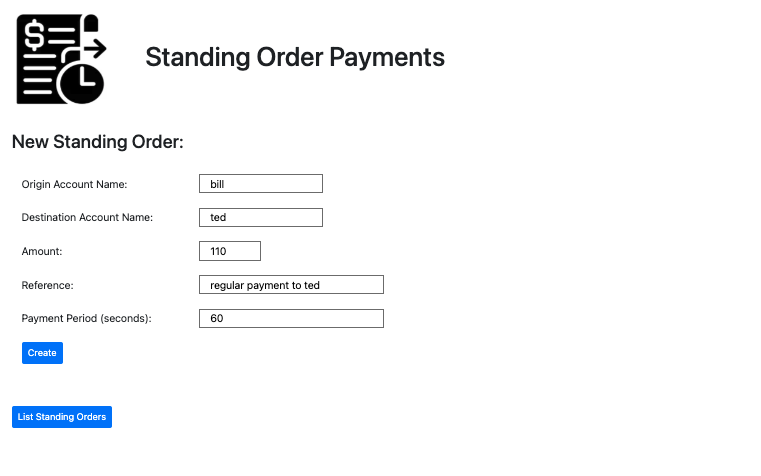
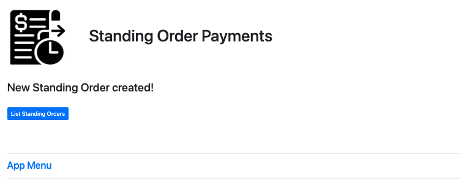
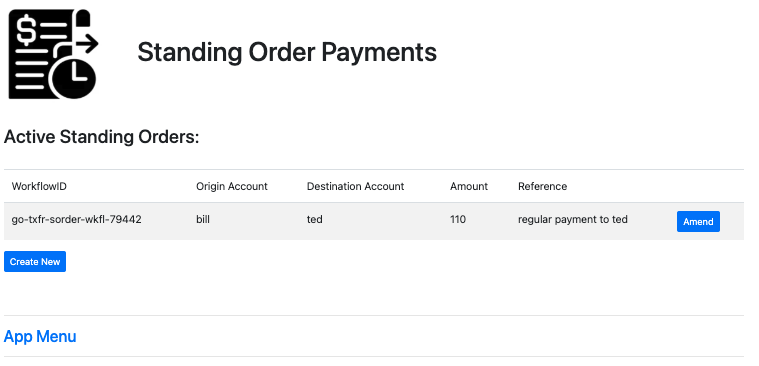
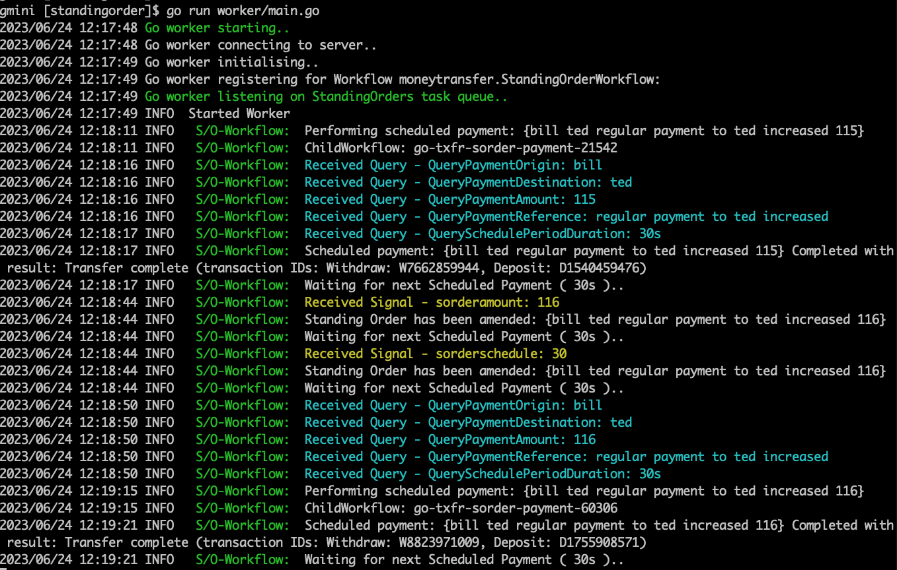

# Standing Orders
Regular Payments from one account to another account, fixed amount with reference comment.  
This demo just pays on a timer, amend is handled by temporal signals and queries to read and change current workflow variables.

  

  

  

  

  
  
