# webapp with temporal workflow backend
This is a sample golang web app with local db task queue and [Temporal](https://temporal.io) Cloud workflow backend interaction.
This app can be used to demonstrate starting a workflow to process durable integration, durable transactions, workflows as entities, and scheduled business workflows.

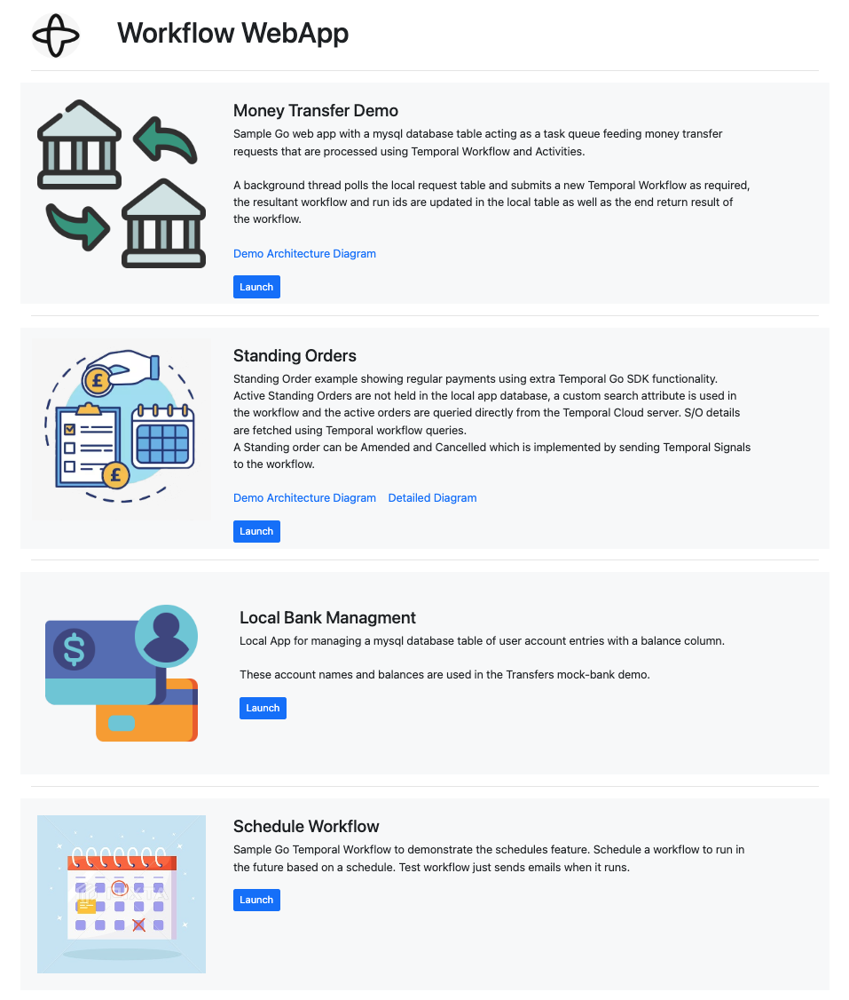

# What is Demonstrated?
Use this demo to show the **simplicity** and **durability** enabled by Temporal for business process developers, in a financial services context.

## Velocity

### Focus on coding the business flow predictably as if there are no distributed systems, let Temporal handle the risks of the distributed reality
* It should be simple for an application to survive a if it crashes or terminates in the middle of a transaction. With Temporal, this is simple. The Temporal runtime makes your your code run to completion, surviving failures along the way.
* It should be simple with Temporal for an application to survive if a critical service it calls is down or unavailable. With Temporal, this is simple.

[As you can see from the code - no code is needed](./moneytransfer/transfer-workflow.go) (other than using the SDK). See it described below [script](#test-some-failure-states) - then test it out for yourself.

### Enjoy simple future programming interface with Temporal 
It should be simple to create code that runs at a specific time or times in the future without complexity or confusion, or having your system trip over itself in the future. With Temporal, this is simple and easy to do, even schedules from user input, such as a scheduled business process, for example moving money. Simple to create, simple to understand, simple to debug, simple to test.
[See the code](./scheduleworkflow/start-scheduleworkflow.go).


### Coordinate and reuse existing workflows
It should be simple to work with multiple levels of workflow orchestration. With Temporal, you can create multiple levels of orchestration simply.
[See the code](./standingorder/sorder-workflow.go#209).

### Create long-running business processses and update workflows once started
It should be easy to update existing business processes while they are in progress. With Temporal, this is done with [signals]([url](https://docs.temporal.io/dev-guide/go/features#signals)).
[See the code](./standingorder/sorder-workflow.go#96).

### Model real-life objects and long-running processes with workflows.
It should be possible to create entities that have a workflow associated with them. Temporal can do this and manage both the wofkflow and its related entity. For more info, see [this blog post](https://temporal.io/blog/long-running).
[See the code](./standingorder/sorder-workflow.go#96).


## Reliability: systems fail, business processes shouldn't, and it should be easy
If your applications or infrastructure dies, or if the systems you need to call go down, it would be nice if all business transactions handled this transparently and easily, without implementing a lot of complex patterns. With Temporal, [no code is needed](./moneytransfer/transfer-workflow.go) - other than using the SDK. See it described below [script](#test-some-failure-states) - then test it out for yourself.

## Visibility: I should be able to see what's happening at any point in time!
Navigate to the Temporal UI at any point to see workflow history, current information, and to understand if something has gone wrong and is recovering.


| Primary Value Demonstration | ✅ |
|:-------------------|---|
| Velocity          | ✅ |
| Reliability       | ✅ |
| Insight           |   |

### Deployment
| Deployment          | ✅ |
|:-------------------|---|
| Local              | ✅ |
| Disconnected       | 🚫 |
| Kubernetes         |  |

### Prerequisites
| Prerequisite       | ✅ |
|:-------------------|---|
| Network Connection | ✅ |
| Go             | ✅|
| Docker             | ✅|
| Temporal CLI | ✅ |

### Features
| Feature            | ✅ | 
|:-------------------|---|
| Schedule       | ✅ |
| Local Activity |   |
| Signal         | ✅ |
| Query          | ✅ |
| Update         | ✅ |
| Heartbeat      |   |
| Timer          | ✅ |
| Activity Retry | ✅ |
| Cron           |   |   
| Data Converter | ✅ |

### Patterns
| Pattern            | ✅ |
|:-------------------|---|
| Entity              | ✅ |
| Fanout              |   |
| Long-polling        |   |
| Continue As New     |   |
| Long-running        | ✅ |
| Manual Intervention | ✅ |
| Saga                | ✅ |

### Additional Features
| Feature            | ✅ |
|:-------------------|---|
| User Interface   | ✅ |

# Setup & Run

## Start local app database first
The sample mysql database has been configured to run using docker-compose locally and initialise the database with users and sample data.
```
cd mysql
docker-compose up -d
docker logs mysql
```

Sample data:
```
docker exec -it mysql mysql -u root -p
Welcome to the MySQL monitor.  Commands end with ; or \g.
...

mysql> describe moneytransfer.transfer;
+-------------+--------------+------+-----+-------------------+-------------------+
| Field       | Type         | Null | Key | Default           | Extra             |
+-------------+--------------+------+-----+-------------------+-------------------+
| id          | int unsigned | NO   | PRI | NULL              | auto_increment    |
| origin      | varchar(30)  | NO   | MUL | NULL              |                   |
| destination | varchar(30)  | NO   |     | NULL              |                   |
| amount      | float        | NO   |     | NULL              |                   |
| reference   | varchar(40)  | NO   |     | NULL              |                   |
| status      | varchar(30)  | NO   |     | NULL              |                   |
| t_wkfl_id   | varchar(50)  | YES  |     | NULL              |                   |
| t_run_id    | varchar(50)  | YES  |     | NULL              |                   |
| t_taskqueue | varchar(50)  | YES  |     | NULL              |                   |
| t_info      | varchar(250) | YES  |     | NULL              |                   |
| datestamp   | timestamp    | NO   |     | CURRENT_TIMESTAMP | DEFAULT_GENERATED |
+-------------+--------------+------+-----+-------------------+-------------------+
11 rows in set (0.00 sec)

mysql> select id,origin,destination,amount,reference,status from moneytransfer.transfer;
+----+--------+-------------+--------+------------------+-----------+
| id | origin | destination | amount | reference        | status    |
+----+--------+-------------+--------+------------------+-----------+
|  1 | bill   | jim         |    120 | IOU              | REQUESTED |
|  2 | jane   | sally       |    107 | FOOD MONEY       | REQUESTED |
|  3 | ted    | harry       |    100 | CART123          | REQUESTED |
|  4 | bill   | ted         |     10 | transfer request | REQUESTED |
+----+--------+-------------+--------+------------------+-----------+
4 rows in set (0.00 sec)

mysql> quit
Bye
```

## Temporal Cloud configuration
This example assumes that you have a temporal cloud configured and have local client certificate files for your namespace.
The values are passed into the demo app using environment variables, example direnv .envrc file is included in the repo:

```
# direnv .envrc

# Temporal Cloud connection
# region: us-east-1
export TEMPORAL_HOST_URL="myns.abcdf.tmprl.cloud:7233"
export TEMPORAL_NAMESPACE="myns.abcdf"

# tclient-myns client cert
export TEMPORAL_TLS_CERT="/Users/myuser/.temporal/tclient-myns.pem"
export TEMPORAL_TLS_KEY="/Users/myuser/.temporal/tclient-myns.key"

# Optional: path to root server CA cert
export TEMPORAL_SERVER_ROOT_CA_CERT=
# Optional: Server name to use for verifying the server's certificate
export TEMPORAL_SERVER_NAME=

export TEMPORAL_INSECURE_SKIP_VERIFY=false

# App temporal taskqueue name for moneytransfer
export TRANSFER_MONEY_TASK_QUEUE="go-moneytransfer"
# timer for transfer table to be checked (seconds)
export CHECK_TRANSFER_TASKQUEUE_TIMER=20

# payload data encryption
export ENCRYPT_PAYLOAD=false
export DATACONVERTER_ENCRYPTION_KEY_ID=mysecretkey

# Set to enable debug logger logging
export LOG_LEVEL=debug

# local mysql backend db connection
export MYSQL_HOST=localhost
export MYSQL_DATABASE=dataentry
export MYSQL_USER=mysqluser
export MYSQL_PASSWORD=mysqlpw
```

### Custom Search Attribute

The demo app makes use of a custom search attribute that needs to be created in Temporal Cloud for the namespace:   

Name: CustomStringField, Type: String

Usage in workflow:
```
workflow.go:  _ = UpcertSearchAttribute(ctx, "CustomStringField", "PROCESSING")
workflow.go:    _ = UpcertSearchAttribute(ctx, "CustomStringField", "FAILED")
workflow.go:    _ = UpcertSearchAttribute(ctx, "CustomStringField", "FAILED")
workflow.go:  _ = UpcertSearchAttribute(ctx, "CustomStringField", "COMPLETED")
```
   
Note: To simulate a banking service outage on an activity without the need to restart the workers there is a bank status UI in the Bank management app.

## Start the webapp and navigate to view the local tasks

Start the webapp, by default it listens on port localhost:8085
```
go run webapp.go
```

Note: The webapp has a background activity thread that periodically polls the database transfer table on a go cron timer looking for entries with status "REQUESTED", if an entry is found it reads the oldest and updates it to "PROCESSING" and starts a corresponding Temporal Workflow.  Example polling can be seen in the webapp terminal:

```
go run webapp.go
2023/06/06 11:36:22 Serve Http on 8085
2023/06/06 11:36:52 CheckTransferQueueTask: called
2023/06/06 11:36:52 QueryTransferRequest: called
2023/06/06 11:36:52 CheckTransferQueueTask: No transfers in queue.
2023/06/06 11:37:22 CheckTransferQueueTask: called
2023/06/06 11:37:22 QueryTransferRequest: called
2023/06/06 11:37:22 CheckTransferQueueTask: No transfers in queue.
...
```

When the transfer poll task does find a pending entry the log looks like:
```
2023/06/06 11:39:03 CheckTransferQueueTask: called
2023/06/06 11:39:03 QueryTransferRequest: called
2023/06/06 11:39:04 QueryTransferRequest: Transfer: {4 bill ted 10 transfer request PROCESSING}
2023/06/06 11:39:04 CheckTransferQueueTask: Transfer: {4 bill ted 10 transfer request PROCESSING}
2023/06/06 11:39:04 CheckTransferQueueTask: PaymentDetails: {bill ted transfer request 10}
2023/06/06 11:39:04 StartMoneyTransfer-72937: called, PaymentDetails: moneytransfer.PaymentDetails{SourceAccount:"bill", TargetAccount:"ted", ReferenceID:"transfer request", Amount:10}
2023/06/06 11:39:04 StartMoneyTransfer-72937: Starting moneytransfer workflow on go-moneytransfer task queue
2023/06/06 11:39:04 StartMoneyTransfer-72937: Started workflow: WorkflowID: go-txfr-webtask-wkfl-72937, RunID: 09d781d2-8d95-4926-a458-b6f2ac49ad37
2023/06/06 11:39:33 CheckTransferQueueTask: called
2023/06/06 11:39:33 QueryTransferRequest: called
2023/06/06 11:39:34 CheckTransferQueueTask: No transfers in queue.
2023/06/06 11:40:03 CheckTransferQueueTask: called
2023/06/06 11:40:03 QueryTransferRequest: called
2023/06/06 11:40:04 CheckTransferQueueTask: No transfers in queue.
2023/06/06 11:40:09 StartMoneyTransfer-72937: Workflow result: "Transfer complete (transaction IDs: W4081768757, D2204353735)"
2023/06/06 11:40:09 StartMoneyTransfer-72937: done.
2023/06/06 11:40:09 UpdateTransferRequest: called (Id: 4 COMPLETED )
2023/06/06 11:40:09 CheckTransferQueueTask: Workflow: go-txfr-webtask-wkfl-72937 Completed
```

## Start the temporal Transfer worker

In a different terminal window to the webapp to separate the terminal log output displayed.

```
cd moneytransfer
go run worker/main.go

2023/06/06 11:27:05 Go worker starting..
2023/06/06 11:27:05 LoadClientOptions: myns.abcdf.tmprl.cloud:7233 myns.abcdf ~/.temporal/tclient-myns.pem ~/.temporal/tclient-myns.key   false true
2023/06/06 11:27:05 Go worker connecting to server..
2023/06/06 11:27:05 Go worker initialising..
2023/06/06 11:27:05 Go worker registering for Workflow moneytransfer.Transfer..
2023/06/06 11:27:05 Go worker registering for Activity moneytransfer.Withdraw..
2023/06/06 11:27:05 Go worker registering for Activity moneytransfer.Deposit..
2023/06/06 11:27:05 Go worker registering for Activity moneytransfer.Refund..
2023/06/06 11:27:05 Go worker listening on go-moneytransfer task queue..
2023/06/06 11:27:05 INFO  Started Worker Namespace myns.abcdf TaskQueue go-moneytransfer WorkerID 94006@gmini.local@
```

Note: the sample worker registers with the taskqueue to handle Workflow and Activity actions for the Transfer Workflow example


## Temporal Cloud Web UI - Data Converter

If you are encrypting the workflow payload content as well then to inspect the workflow history data values you can connect to a localhost codec server that implements /decode url configured for the same dataconverter used in your temporal client app code.   

Start the local codec server (in a new terminal window) using:
```
cd dataconverter/codec-server-go
go run server.go

2023/06/06 11:48:46 Serve Http on 8888
```
# Demo Walkthrough - Money Transfer
## WebApp Transfers UI

### List Transfers

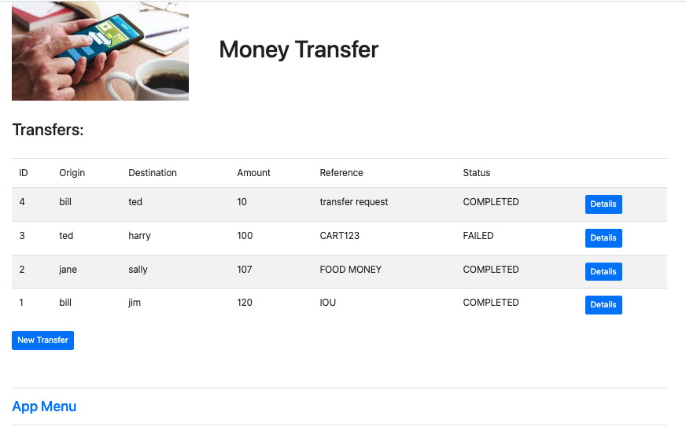

### New Transfer

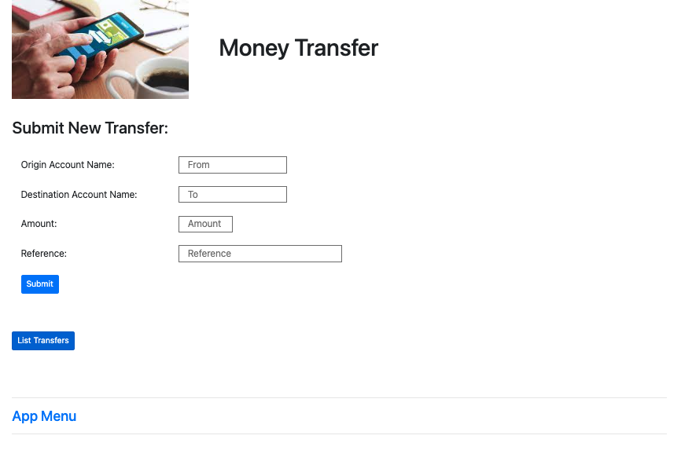

Note: Currently the account names need to match the list hardcoded in banking-client.go:61 mockBank var   
Update-20230608: Updated the banking-client to populate the account names from the mysql db accounts table instead of the hardcoded mockbank variable.

### Transfer Details (COMPLETED)

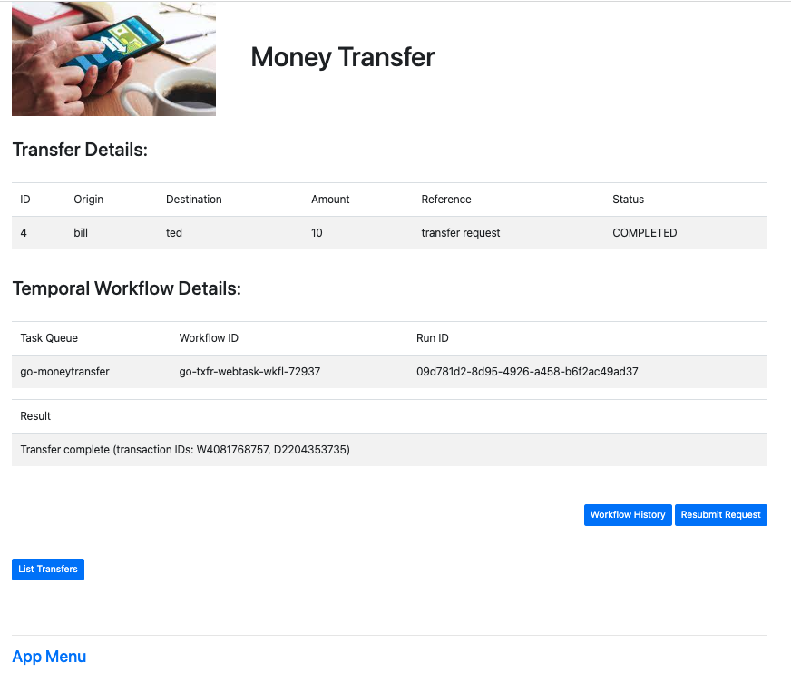

### Transfer Details (FAILED)

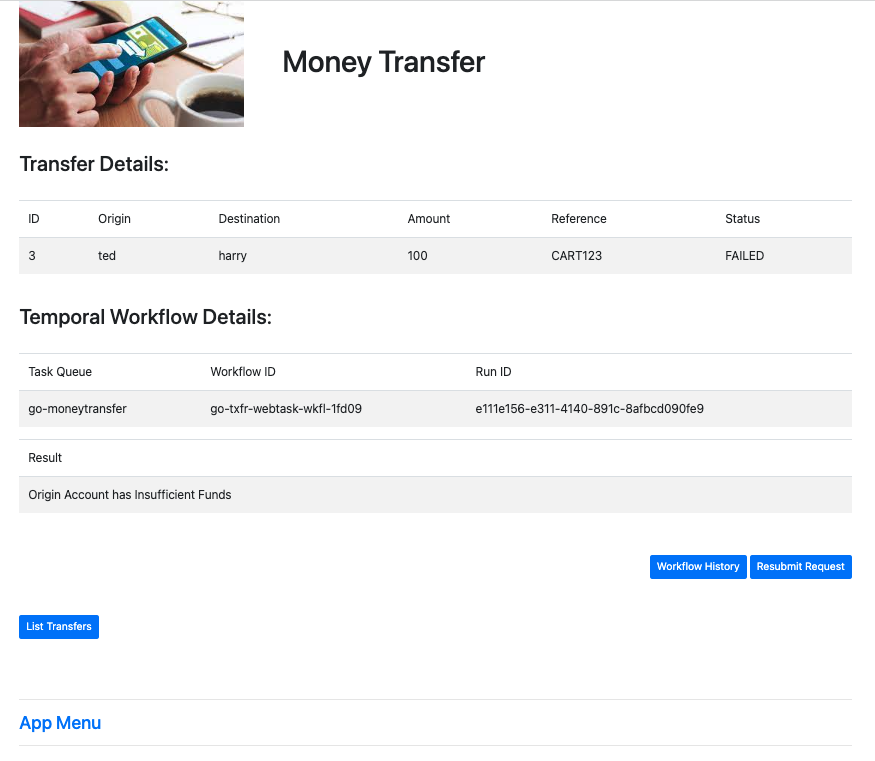

Note: This failed as ted's account was configured with 10 and a transfer of 100 was requested.  
```go
    {AccountNumber: "ted", Balance: 10},
```

The Activity retry policy will keep retrying unless the activity returns specific error types listed:
```go
    NonRetryableErrorTypes: []string{"InvalidAccountError", "InsufficientFundsError"},
```

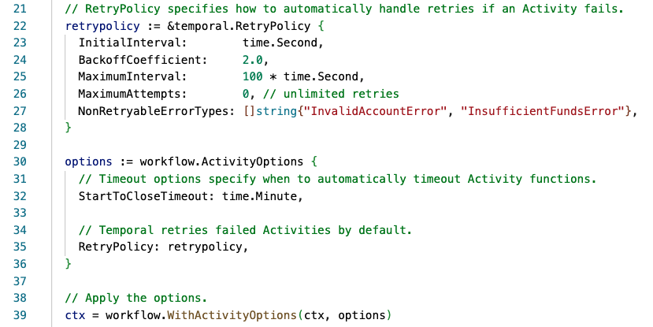


## Test some failure states

### Two workers, second one picks up workflow where left by "failed" worker

There is a sleep timer between the Withdraw and Deposit Activities.  This allows two workers to be started and the one that is sleeping exited to observe the other picking up the transaction where it was left off.


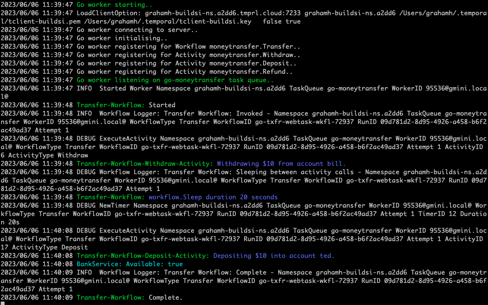

### Simulate Banking Client unavailable

You can disable the Banking app Deposit function by setting the Bank Open/Closed status in the Bank App UI:

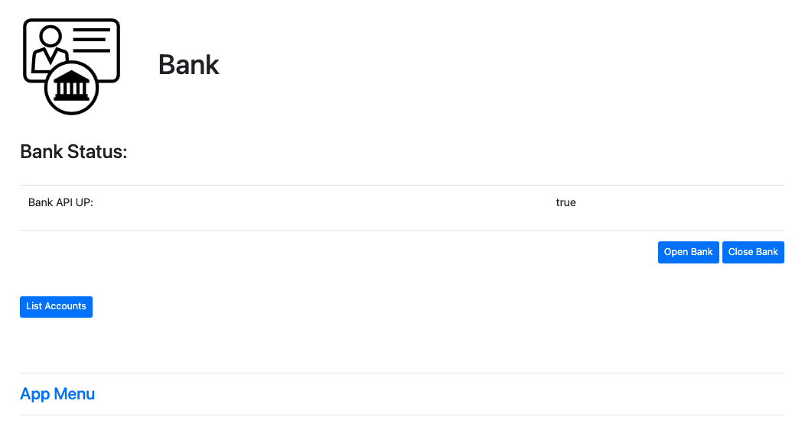

The Activity return policy does not contain:
```go
func (m *BankIntermittentError) Error() string {
  return "Banking Service currently unavailable"
}
```
so the activity will loop retrying, backing off etc..  

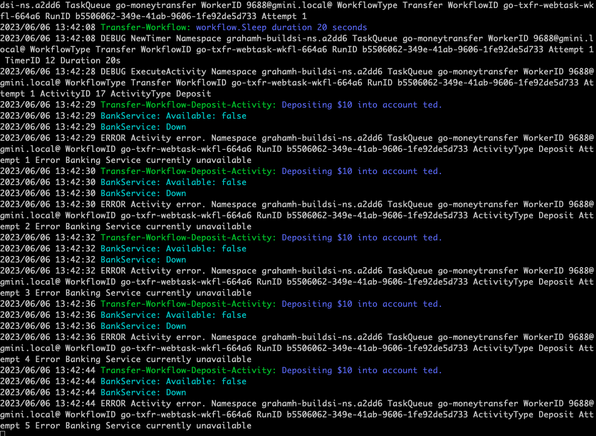

Change the bank status back to Open to simulate bank back up.  

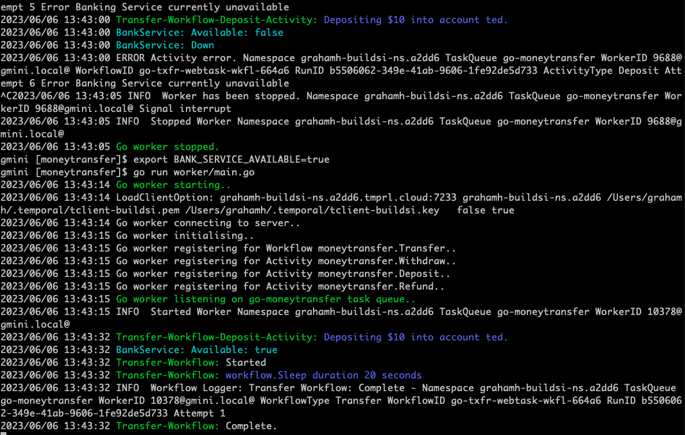

Notice the Workflow History for the affected Withdraw or Deposit Activity will have a multiple retry count:

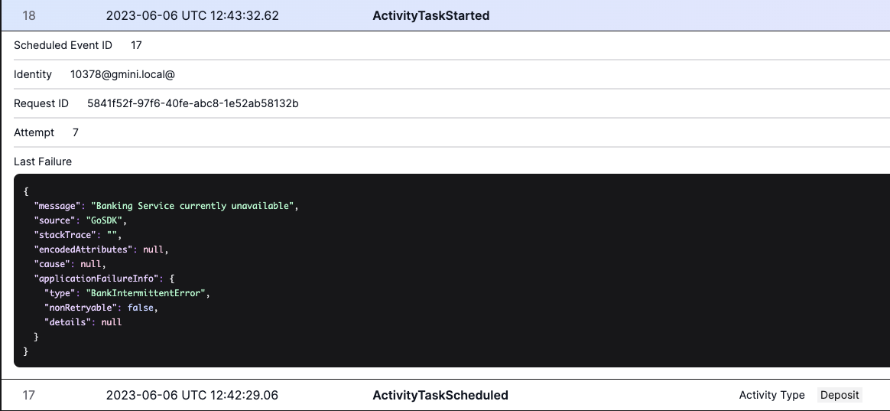
  
# Other Demos
See [Schedule Workflow](./ScheduleWorkflow.md) and [Standing Orders](./StandingOrders.md) for other demos.
